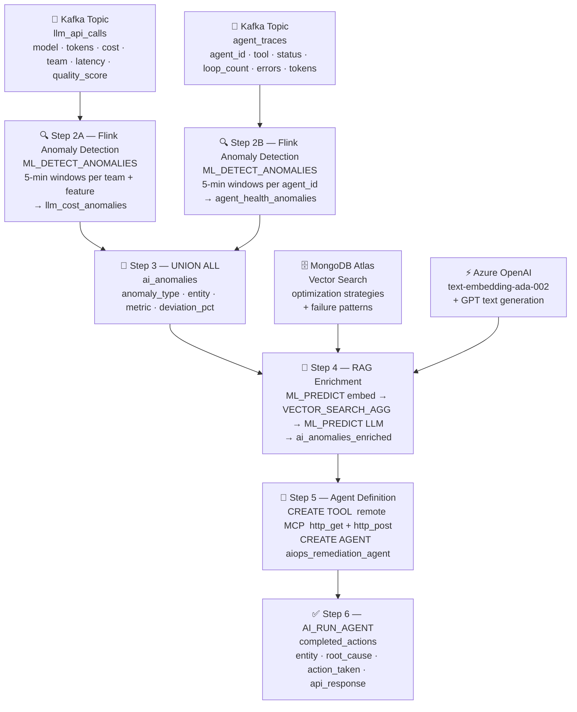

# AIOps Monitoring Agent

A real-time AI cost and health monitoring pipeline built on **Confluent Cloud Flink SQL**. It detects LLM cost spikes and agent loop anomalies, enriches them with RAG-generated root cause analysis, and autonomously remediates issues by calling live APIs — all as a single continuous streaming pipeline.

Built for the **Confluent AI Day Toronto Hackathon**.

---

## Architecture



The full draw.io source is in [`architecture.drawio`](./architecture.drawio) — open it at [app.diagrams.net](https://app.diagrams.net) to view or edit.

---

## What it does

### Problem
As teams ship more AI features, LLM API costs and agentic system behaviour become increasingly hard to monitor. A single misconfigured model routing rule or a looping agent can silently drain budget or degrade quality before anyone notices.

### Solution
This pipeline continuously monitors two real-time event streams:

| Stream | What it tracks |
|--------|---------------|
| `llm_api_calls` | Every LLM API call: model used, token counts, cost, latency, quality score |
| `agent_traces` | Every agent execution: tool calls, loop count, errors, duration |

It then:
1. **Detects anomalies** in 5-minute windows using Flink's `ML_DETECT_ANOMALIES` function
2. **Enriches each anomaly** with a RAG-generated root cause explanation using MongoDB Atlas Vector Search + Azure OpenAI
3. **Autonomously remediates** by running a Flink AI Agent that calls live APIs to downgrade models or restart agents

---

## Pipeline Steps

### Step 1 — Ingest
Two Flink tables backed by Kafka topics with Avro schemas registered in Schema Registry:

- **`llm_api_calls`** — one record per LLM API call, with `cost_usd`, `input_tokens`, `output_tokens`, `model`, `team`, `feature_name`, `quality_score`
- **`agent_traces`** — one record per agent execution, with `loop_count`, `status`, `error_type`, `tokens_used`, `duration_ms`

All fields are `NOT NULL` to match the non-nullable Avro schema Flink generates.

### Step 2 — Anomaly Detection
5-minute `TUMBLE` windows aggregate metrics per group, then `ML_DETECT_ANOMALIES` scores each window using a streaming statistical model:

```sql
ML_DETECT_ANOMALIES(
    CAST(total_cost_usd AS DOUBLE),
    window_time,
    JSON_OBJECT('minTrainingSize' VALUE 10, 'confidencePercentage' VALUE 99.0, ...)
) OVER (
    PARTITION BY team, feature_name
    ORDER BY window_time
    RANGE BETWEEN UNBOUNDED PRECEDING AND CURRENT ROW
) AS anomaly_result
```

Only rows where `is_anomaly = TRUE AND metric > upper_bound` are emitted downstream.

### Step 3 — Union
Both anomaly streams are merged into a single `ai_anomalies` table with a unified schema:

| Column | Description |
|--------|-------------|
| `entity` | `team/feature` or `agent_id` |
| `anomaly_type` | `LLM_COST_SPIKE` or `AGENT_LOOP_SPIKE` |
| `metric_value` | The anomalous value |
| `deviation_pct` | How far above the expected upper bound (%) |

### Step 3.5 — Vector Knowledge Base
A MongoDB Atlas collection (`aiops_knowledge.documents`) loaded with 15 curated AIOps documents covering:
- Model routing optimization (GPT-4 vs GPT-3.5-Turbo cost/quality tradeoffs)
- Cost spike root causes and remediation patterns
- Agent loop detection and restart procedures
- Retry storm prevention
- Token budget management
- RAG retrieval quality optimization

Documents are embedded with `text-embedding-ada-002` (1536 dimensions) and indexed with Atlas Vector Search.

### Step 4 — RAG Enrichment
For each anomaly, the pipeline:
1. **Embeds** the anomaly description using `ML_PREDICT('llm_embedding_model', ...)`
2. **Retrieves** the 3 most relevant knowledge base chunks via `VECTOR_SEARCH_AGG`
3. **Generates** a 1-2 sentence root cause + remediation recommendation via `ML_PREDICT('llm_textgen_model', ...)`

```sql
FROM ai_anomalies a,
LATERAL TABLE(ML_PREDICT('llm_embedding_model', ...)) AS emb,
LATERAL TABLE(VECTOR_SEARCH_AGG(documents_vectordb_aiops, DESCRIPTOR(embedding), emb.embedding, 3)) AS vs,
LATERAL TABLE(ML_PREDICT('llm_textgen_model', CONCAT('ANOMALY: ... CONTEXT: ', vs.search_results[1].chunk, ...))) AS llm_response
```

### Step 5 — Remediation Agent
A Flink AI Agent with access to two MCP tools over HTTP:

| Anomaly type | Action |
|---|---|
| `LLM_COST_SPIKE` | `GET /api/model_routing` → identify oversized model → `POST` to downgrade |
| `AGENT_LOOP_SPIKE` | `GET /api/agent_status` → `POST` to restart agent with fresh context |

### Step 6 — Results
The `completed_actions` table captures the full audit trail: entity, anomaly type, root cause, action taken, and raw API response — parsed out of the agent's structured output with `REGEXP_EXTRACT`.

---

## Setup

### Prerequisites
- Python 3.11+
- A Confluent Cloud account with a Kafka cluster and Flink compute pool
- Azure OpenAI access (workshop credentials or your own)
- MongoDB Atlas free tier cluster

### Install dependencies

```bash
python -m venv .venv
source .venv/bin/activate
pip install 'confluent-kafka[avro,schema-registry]' python-dotenv pymongo openai
```

### Configure credentials

```bash
cp .env.example .env
# Edit .env with your values
```

```
KAFKA_BOOTSTRAP_SERVERS=...
KAFKA_API_KEY=...
KAFKA_API_SECRET=...
SCHEMA_REGISTRY_URL=...
SCHEMA_REGISTRY_API_KEY=...
SCHEMA_REGISTRY_API_SECRET=...

AZURE_OPENAI_ENDPOINT=https://<your-resource>.openai.azure.com/
AZURE_OPENAI_API_KEY=...

MONGODB_URI=mongodb+srv://<user>:<pass>@<cluster>.mongodb.net/
MONGODB_DATABASE=aiops_knowledge
MONGODB_COLLECTION=documents
```

### Load the knowledge base

```bash
python load_knowledge_base.py
```

This embeds 15 AIOps documents and loads them into MongoDB Atlas. Creates the `vector_index` if it doesn't exist (~60s to become active).

### Produce sample events

```bash
python datagen.py
```

Sends ~300 events spread across multiple teams, models, and agent IDs. Injects deliberate anomalies at windows 100, 180, and 250 (LLM cost spikes) and 140, 220 (agent loop spikes).

### Run the Flink SQL pipeline

Open the Confluent Cloud Flink SQL workspace and execute `pipeline.sql` **one statement at a time**, in order:

| Step | Statement | Notes |
|------|-----------|-------|
| 1A | `CREATE TABLE llm_api_calls` | |
| 1B | `CREATE TABLE agent_traces` | |
| 2A | `CREATE TABLE llm_cost_anomalies AS ...` | Starts streaming |
| 2B | `CREATE TABLE agent_health_anomalies AS ...` | Starts streaming |
| 3 | `CREATE TABLE ai_anomalies AS ...` | Starts streaming |
| 3.5A | `CREATE CONNECTION mongodb-connection` | Skip if Lab 2 deployed it |
| 3.5B | `CREATE TABLE documents_vectordb_aiops` | |
| 4 | `CREATE TABLE ai_anomalies_enriched AS ...` | Starts RAG enrichment |
| 5A | `CREATE TOOL aiops_remote_mcp` | |
| 5B | `CREATE AGENT aiops_remediation_agent` | |
| 6 | `CREATE TABLE completed_actions AS ...` | Starts autonomous remediation |

> **Timing note**: run the datagen script _after_ Steps 1A and 1B are created (the tables use `latest-offset`).

---

## Tech Stack

| Layer | Technology |
|-------|-----------|
| Streaming platform | Confluent Cloud (Kafka + Flink SQL) |
| Anomaly detection | Confluent `ML_DETECT_ANOMALIES` |
| Embedding model | Azure OpenAI `text-embedding-ada-002` |
| Text generation | Azure OpenAI GPT (via `llm_textgen_model`) |
| Vector database | MongoDB Atlas Vector Search |
| Autonomous agent | Confluent `CREATE AGENT` + `AI_RUN_AGENT` |
| Remote tools | MCP server (http_get, http_post) |
| Data serialization | Avro + Confluent Schema Registry |

---

## Files

```
ai-cost-guardian/
├── pipeline.sql          # Full 6-step Flink SQL pipeline
├── datagen.py            # Kafka event producer with injected anomalies
├── load_knowledge_base.py # MongoDB Atlas knowledge base loader
├── architecture.drawio   # Pipeline architecture diagram (app.diagrams.net)
├── .env.example          # Credential template
└── README.md
```
